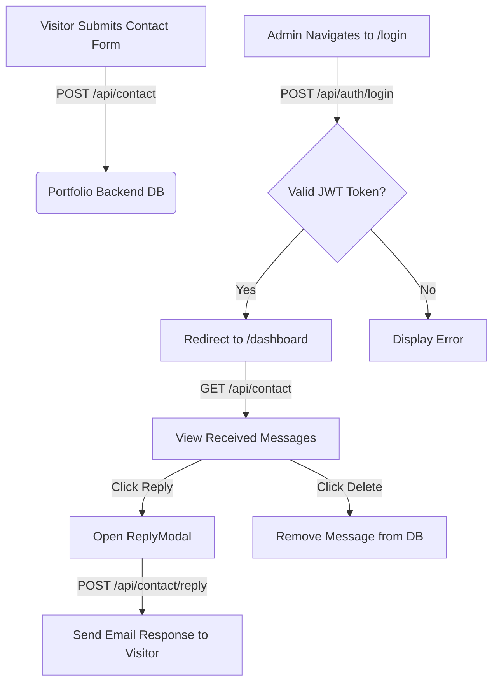

<div align="center">

  <h1>✨ Animesh Pathak — Interactive 3D Portfolio</h1>

  <p>
    <b>A state-of-the-art, high-performance web portfolio for Animesh Pathak built with React 19, TypeScript, Vite, Three.js & Framer Motion.</b>
  </p>

  <p>
    <a href="https://react.dev/"></a>
    <a href="https://www.typescriptlang.org/"></a>
    <a href="https://vitejs.dev/"></a>
    <a href="https://threejs.org/"></a>
    <a href="https://www.framer.com/motion/"></a>
    <a href="https://gsap.com/"></a>
  </p>

  <p>
    <a href="#-key-features">Key Features</a> •
    <a href="#%EF%B8%8F-tech-stack--ecosystem">Tech Stack</a> •
    <a href="#-project-structure">Project Structure</a> •
    <a href="#%EF%B8%8F-environment-setup--configuration">Environment Setup</a> •
    <a href="#-getting-started">Getting Started</a> •
    <a href="#-admin-dashboard--authentication">Admin Dashboard</a> •
    <a href="#-license">License</a>
  </p>

</div>

---

## 🌟 Overview

Welcome to **Animesh Pathak's Portfolio Frontend** repository! This web application serves as a modern, immersive, and interactive portfolio platform designed to showcase projects, skills, professional experience, and achievements.

Engineered with **React 19**, **TypeScript**, and **Vite 7**, the portfolio combines 3D canvas physics, custom shader backgrounds (`LiquidEther`), ambient audio controls, micro-interactions, and a secure backend-integrated **Admin Management Dashboard**.

> [!TIP]
> __Live Backend Connection__: This frontend seamlessly connects to the deployed Render backend API (`VITE_BACKEND_URL`) for real-time contact form processing and administrator message management.

---

## 🔥 Key Features

- 🌌 **3D Canvas & Shader Visuals**: Real-time particle interaction canvas ([Background3D.tsx](file:///f:/PortfolioFrontend/src/components/Background3D.tsx)) paired with GPU-accelerated liquid fluid dynamics ([LiquidEther.tsx](file:///f:/PortfolioFrontend/src/sections/LiquidEther.tsx)).
- 🎵 **Ambient Audio Experience**: Integrated interactive background music controller with automatic volume easing and user toggles.
- 🎯 **Interactive Custom Cursor**: Smooth mouse-tracking cursor with dynamic scaling state feedback on interactive UI components ([CustomCursor.tsx](file:///f:/PortfolioFrontend/src/components/CustomCursor.tsx)).
- 🚀 **Dynamic Portfolio Showcase**:
   - **Hero**: Dynamic typography, profile card, downloadable CV, and status badges ([Hero.tsx](file:///f:/PortfolioFrontend/src/sections/Hero.tsx)).
   - **About**: Professional summary, key metrics, and personal introduction ([About.tsx](file:///f:/PortfolioFrontend/src/sections/About.tsx)).
   - **Skills**: Categorized technology grid with visual proficiency indicators ([Skills.tsx](file:///f:/PortfolioFrontend/src/components/Skills.tsx)).
   - **Projects**: Live demo previews, GitHub repository integration, filterable project categories, and tech stack tags ([Projects.tsx](file:///f:/PortfolioFrontend/src/components/Projects.tsx)).
   - **Timeline**: Interactive visual career roadmap detailing experience and education milestones ([Timeline.tsx](file:///f:/PortfolioFrontend/src/components/Timeline.tsx)).
   - **Footer & Contact**: Real-time contact form with immediate validation and direct backend dispatch ([Footer.tsx](file:///f:/PortfolioFrontend/src/components/Footer.tsx)).

- 🔒 **Secured Admin Portal (`/login` & `/dashboard`)**:
   - Protected routing with JWT authentication ([ProtectedRoute.tsx](file:///f:/PortfolioFrontend/src/ProtectedRoute.tsx)).
   - Real-time message management (read/unread status, delete actions, reply modal) ([Dashboard.tsx](file:///f:/PortfolioFrontend/src/components/Dashboard.tsx)).
   - Modal-based response dispatching ([ReplyModal.tsx](file:///f:/PortfolioFrontend/src/components/ReplyModal.tsx)) to communicate directly with leads and recruiters.

- ⚡ **Next-Gen Performance**: Enabled **React Compiler** (`babel-plugin-react-compiler`) and Vite HMR for zero-lag 60 FPS visual rendering.

---

## 🛠️ Tech Stack & Ecosystem

### Core & Framework

| Technology | Description |
| :--- | :--- |
| **[React 19](https://react.dev/)** | Component-driven UI library utilizing the latest React 19 features |
| **[TypeScript 5.9](https://www.typescriptlang.org/)** | Type safety, enhanced IntelliSense, and maintainable data contracts |
| **[Vite 7](https://vitejs.dev/)** | Next-generation frontend build tool providing lightning-fast HMR |

### 3D Graphics & Animations

| Library | Purpose |
| :--- | :--- |
| **[Three.js](https://threejs.org/)** | 3D WebGL renderer and math engine |
| **[React Three Fiber](https://r3f.docs.pmnd.rs/)** | Declarative Three.js wrapper for React |
| **[Drei](https://github.com/pmndrs/drei)** | Useful helpers and abstractions for React Three Fiber |
| **[Framer Motion](https://www.framer.com/motion/)** | Smooth scroll animations, exit transitions, and layout spring physics |
| **[GSAP](https://gsap.com/)** | High-performance timeline animation engine |

### Networking & Routing

| Tool | Purpose |
| :--- | :--- |
| **React Router DOM v7** | Client-side routing for multi-page views (`/`, `/login`, `/dashboard`) |
| **Axios** | HTTP client for asynchronous REST API communication with the backend |
| **React Hook Form** | Performant, flexible form validation and submit handling |
| **Lucide React & React Icons** | Lightweight vector icons |

---

## 📁 Project Structure

```ini
PortfolioFrontend/
├── public/
│   └── img.jpg              # Profile and asset images
├── src/
│   ├── assets/              # Static media assets & audio files
│   ├── components/          # Reusable UI components & section layouts
│   │   ├── Background3D.tsx # 2D/3D Particle proximity canvas
│   │   ├── CustomCursor.tsx # Smooth tracking interactive cursor
│   │   ├── Dashboard.tsx    # Admin message management dashboard
│   │   ├── Footer.tsx       # Interactive contact form & social links
│   │   ├── Loader.tsx       # App initial loading screen
│   │   ├── Navbar.tsx       # Glassmorphic floating header navbar
│   │   ├── Projects.tsx     # Filterable project showcase cards
│   │   ├── ReplyModal.tsx   # Admin email reply modal component
│   │   ├── Skills.tsx       # Interactive technology skills grid
│   │   ├── Timeline.tsx     # Career & education experience roadmap
│   │   └── login.tsx        # JWT admin authentication page
│   ├── sections/            # Major page view sections
│   │   ├── About.tsx        # Personal bio & quick metrics
│   │   ├── Hero.tsx         # Primary hero view with LiquidEther shader
│   │   ├── LiquidEther.tsx  # WebGL fluid shader animation background
│   │   └── LiquidEther.css  # Shader specific styling
│   ├── types/               # TypeScript interfaces & API payload schemas
│   │   └── github.ts        # GitHub API response types
│   ├── App.tsx              # Main portfolio layout assembler
│   ├── main.tsx             # React Router setup & entry point
│   ├── ProtectedRoute.tsx   # Auth guard component for protected paths
│   ├── index.css            # Design tokens, typography & CSS variables
│   └── App.css              # Global layout utility classes
├── .env                     # Environment variables configuration
├── package.json             # Dependencies & project scripts
├── vite.config.ts           # Vite build & React compiler setup
└── tsconfig.json            # TypeScript compiler configuration
```

---

## ⚙️ Environment Setup & Configuration

To run this application locally or deploy it to production, configure your `.env` file in the root directory:

```env
# GitHub Personal Access Token (for dynamic repository statistics)
VITE_GITHUB_TOKEN=your_github_personal_access_token

# Backend REST API Endpoint (Render / Production / Local)
VITE_BACKEND_URL=http://localhost:5000
VITE_API_URL=http://localhost:5000
```

> [!NOTE]
> Ensure the backend server is running to enable full contact form submission and authentication functionality.

---

## 🚀 Getting Started

Follow these simple steps to set up and run the frontend locally on your machine.

### Prerequisites

- **Node.js** (v18.0.0 or higher recommended)
- **npm** (v9.0.0 or higher)

### Installation

1. **Clone the repository:**

```bash
git clone https://github.com/your-username/PortfolioFrontend.git
cd PortfolioFrontend
```

2. **Install dependencies:**

```bash
npm install
```

3. **Configure Environment:**
   Create a `.env` file with the variables listed above.

4. **Launch Development Server:**

```bash
npm run dev
```

The application will be accessible at `http://localhost:4000`.

---

## 📜 Available Scripts

In the project directory, you can run:

| Command | Action |
| :--- | :--- |
| `npm run dev` | Runs the app in development mode with Vite HMR |
| `npm run build` | Compiles TypeScript and builds production bundles into `dist/` |
| `npm run preview` | Locally preview the production build output |
| `npm run lint` | Runs ESLint to check for code quality and formatting issues |

---

## 🔑 Admin Dashboard & Authentication

The portfolio includes an administrative workflow for managing incoming messages sent through the contact form.



1. **Accessing Login**: Navigate to `/login`.
2. **Authentication**: Enter admin credentials to receive a signed JWT token saved securely in `localStorage`.
3. **Managing Contacts**: `/dashboard` displays received messages with options to mark as contacted, open the `ReplyModal` to compose an email response, or remove entries.

---

## 🎨 Design Philosophy & Performance

- **Glassmorphism & Dynamic Visuals**: Designed with a sleek dark aesthetic, subtle backdrop blurs, glow effects, and modern color palettes.
- **60 FPS Hardware Acceleration**: Utilizes WebGL canvas render loops with efficient requestAnimationFrame hooks and particle pool management.
- **React Compiler Integration**: Configured with `babel-plugin-react-compiler` for automatic memoization of component subtrees and hooks.

---

## 🤝 Contributing

Contributions, issues, and feature requests are welcome! Feel free to check the [issues page](https://github.com/your-username/PortfolioFrontend/issues).

1. Fork the Project
2. Create your Feature Branch (`git checkout -b feature/AmazingFeature`)
3. Commit your Changes (`git commit -m 'Add some AmazingFeature'`)
4. Push to the Branch (`git push origin feature/AmazingFeature`)
5. Open a Pull Request

---

## 📄 License

Distributed under the **MIT License**.

---

<div align="center">
  <p>Crafted with ❤️ and passion by <b>Animesh Pathak</b>.</p>
</div>